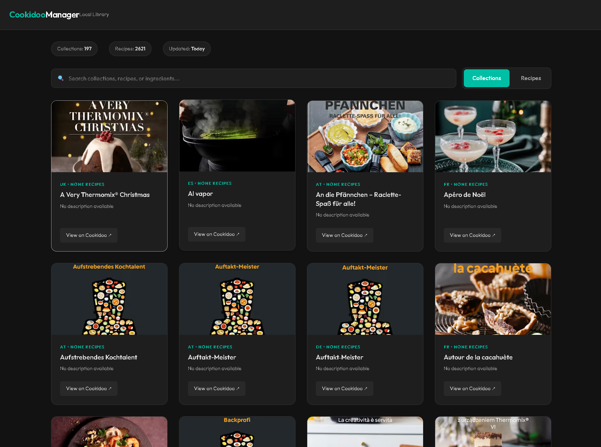

# Cookidoo Collection

A searchable, offline catalog of Thermomix Cookidoo recipes - browse your entire library without internet.



## 🍳 Features

- **Dark Mode UI** - Easy on the eyes
- **Instant Search** - Filter recipes by name, ingredients, or cookbook
- **Fully Offline** - Works without internet after download
- **Mobile Friendly** - Responsive design for any device
- **197 Collections** / **2621 Recipes** ready to browse

## 🔧 Build Your Own Collection

Want to create your own personalized catalog? Here's how:

1. **Log into [Cookidoo](https://cookidoo.thermomix.com)** with your subscription
2. **Browse and add recipes** to your collections - click through the site and save the ones you want
3. **Clone this repo** and add your credentials to `.env`:
   ```ini
   COOKIDOO_EMAIL=your.email@example.com
   COOKIDOO_PASSWORD=your_password
   ```
4. **Run the extraction scripts** (see below) to build your personalized HTML catalog

### Extraction Commands

```bash
# 1. Scrape Collections
docker-compose run --rm cookidoo python cookidoo_page_scraper.py --country au --all-regions --max-per-region 300

# 2. Extract Recipes
docker-compose run --rm cookidoo python cookidoo_catalog_extractor.py

# 3. Build Website
docker-compose run --rm cookidoo python cookidoo_web_builder.py
```

## 📖 Quick Usage

Just want to browse? Download `index.html` and open in any browser - no setup required.

## 📊 Stats

- **2.5MB** standalone HTML file
- No dependencies or external files required
- Works on any device with a web browser

---

*Built with Python + Docker • [View on GitHub](https://github.com/ademczuk/cookidoo-collection)*
